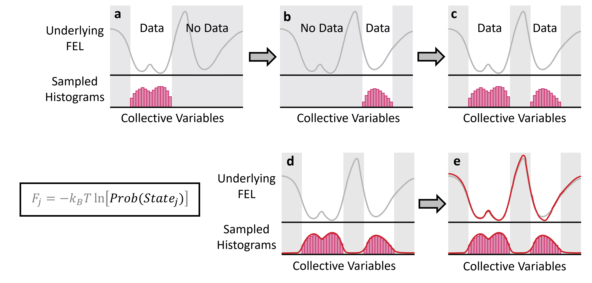
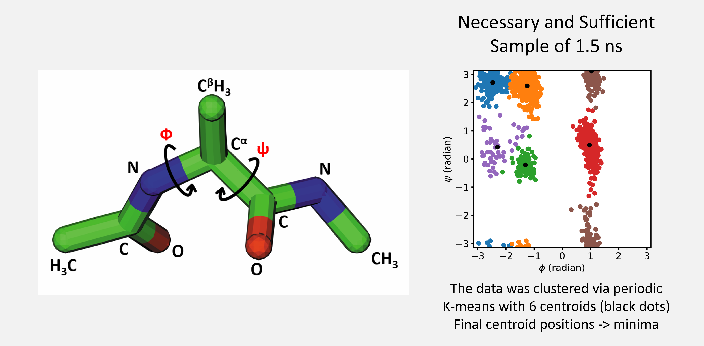
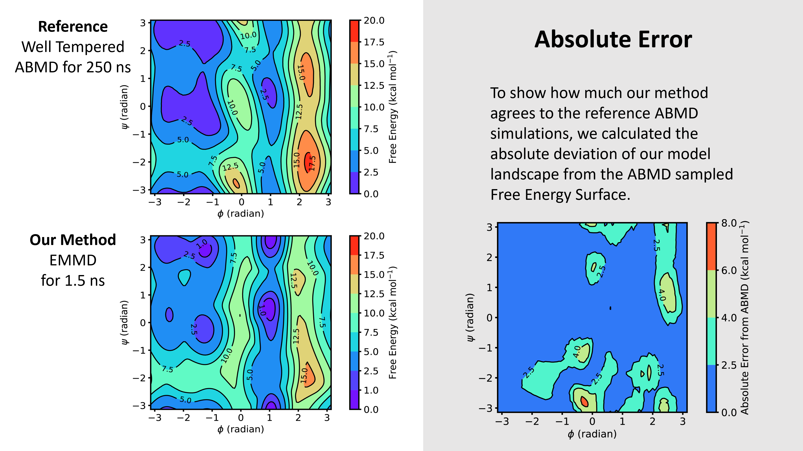

## Expectation Maximized Molecular Dynamics: A New Frontier in Free Energy Barrier Estimation

- **Authors:** Pallab Dutta
- **Affiliation:** Department of Biological Sciences, Indian Institute of Science Education and Research (IISER) Kolkata
- **Published in:** *The Journal of Chemical Physics*, October 2020
- **DOI:** [10.1063/5.0021910](https://doi.org/10.1063/5.0021910)

---

Imagine, you and your friends plan a summer trek across a mountain that separates two valleys — the East and the West. Half of your group starts from the East valley, and you with the rest start from the West. Right from the beginning, the weather is stormy and cloudy. A thick fog covers the mountain, so dense that you can’t see more than a few steps ahead. You have to depend on an altitude meter to know how high you’ve climbed. As both groups go up, you start feeling very tired halfway through. Climbing becomes harder, not just because of the path, but also because gravity makes it tougher the higher you go. With no clear view and the weather getting worse, both teams decide to go back to their own valleys. Later, using the altitude data from both sides, you try to figure out how tall the mountain is — even though no one actually saw or reached the top.

This reflects a common challenge in molecular simulations. The two valleys represent two stable states of a biomolecular system — such as folded and unfolded protein structures. The mountain in between is symbolic to a high-energy barrier, or the transition state, that separates these stable states. Understanding the free energy landscape (FEL) — which includes these valleys and the mountain — is essential for studying processes like protein folding, enzyme catalysis, and phase transitions. However, just like in the trek where no one could see or reach the peak, standard molecular dynamics (MD) simulations struggle to sample these rarely visited, high-energy transition states. These states remain hidden due to computational limitations and the complex, quasi-nonergodic behavior of molecular systems.

To address this challenge, we introduce a novel algorithm — **Expectation Maximized Molecular Dynamics (EMMD)** — that efficiently estimates key features of the FEL without the need for direct sampling of rarely visited high‑energy states.

---

### Methodology

Herein, we want to solve this problem 
Fully atomistic MD simulation is performed independently for known metastable conformations of the system. This generates disjoint samples separated by high kinetic barriers over the free energy landscape. 

Primarily the quasi-nonergodic behavior appears as a consequence of kinetic trapping inside the metastable basins, which leads to:
- Oversampling of the metastable basins.
- Undersampling of the high free-energy regions. 

Herein we borrowed the Expectation Maximization (EM) algorithm from the domain of statistical inference. This soft clustering technique is used to estimate a continuous probability density function ( $pdf$ ) as a mixture of Gaussians from our disjoint samples. This continuous estimate of the $pdf$ is then utilized to solve the above two problems related to sampling.

<b>Figure 1</b> Diagrams illustrating the process of constructing a free energy landscape. The gray curve represents a reference free energy landscape (FEL). (a - c) Raw disjoint samples distributions, (d) A continuous probability density function (red curve) estimated by the Gaussian mixture model, and (e) a continuous free energy landscape derived by Boltzmann inversion of the pdf.

 
 

* **Necessary and Sufficient Sampling:** 
While sampling a metastable state, we keep comparing the $pdf$  corresponding to that state at time $t$ and $t+\Delta t$. The simulation at individual basin is ceased when the difference between these two distributions, $pdf_{t}$ and $pdf_{t+\Delta t}$ becomes close to zero. The converged $pdf$ can be considered as the representative of the local state distribution, and the trajectory can be thought of an ensemble of necessary and sufficient amount of samples. 

* **Free Energy Estimation:** After performing the necessary and sufficient sampling at each metastable state, we proceed to construct an estimate for the population distribution from the disjoint sample distributions. At this stage, a Gaussian mixture model is fit over the concatenated trajectories collected from all different states. We assume this $pdf$ to be the unbiased Boltzmann distribution of the system. Now, we apply the Boltzmann inversion to have the continuous free energy landscape as a function of the collective variables of the system. 

---

### Key Findings

We applied EMMD to three distinct case studies, demonstrating its effectiveness in:

1. Estimating free energy barrier related to the isomerization of Proline. 
2. Constructing the free energy landscape of Alanine dipeptide.
3. Understanding the effects of fluorination in proline dipeptide.

We intend to construct the complete FEL of Alanine dipeptide as a function of the Ramachandran dihedrals ($\phi$, $\psi$). A necessary and sufficient ensemble of 1.5 ns is projected over the CV space to depict that all the known minima in the FEL are sampled. 

<b>Figure 2</b> The Alanine-dipeptide in stick representation, and the necessary and sufficient ensemble projected over the Ramachandran dihedrals. 

 
 

A mixture of 12 bivariate cosine von-Mises distribution was employed to learn the probabilities for the unsampled regions. We noticed that for periodic variables (e.g. angles, dihedrals), von Mises mixtures work better than GMMs due to their inherent periodicity. The estimate of the FEL from this desnsity estimate is shown in Figure 3.

<b>Figure 3</b> Free energy landscape estimated by EMMD as compared to the reference FEL computed by Adaptively Biased Molecular Dynamics (ABMD), an enhanced sampling protocol. The absolute deviation summarizes the confidence of the free energy prediction in different regions of the CV space.

 
 

The result is quite similar to the FEL computed via a standard enhanced sampling protocol, the Adaptively Biased Molecular Dynamics (ABMD). However, it is found that EMMD does a significantly efficient job when we compare the required computational resources to produce the reported landscape. A comparision of the performances between these two methods are provided in the following table.

|   Method   | Number of processors | Total CPU time |
|------------|----------------------|----------------|
|    ABMD    |          16          |  ~ 1 week      |
|  Our EMMD  |           6          |  < 10 hours    |
|            |                      |                |

---

### Take Home Summary

* EMMD presents a promising alternative to traditional enhanced sampling techniques, offering a computationally efficient means to estimate complex FELs. 
* By avoiding direct sampling of high‑energy states and incorporating the necessary-sufficient sampling mechanism, EMMD reduces total sampling time.
* Similar to our trekking story, EMMD uses the minimal available data about the metastable basins to provide a maximum likely estimate for the free energy barrier (the hill in the story).

### Future Directions

* Extending EMMD to higher‑dimensional FELs to handle more complex systems with multiple interacting variables.
* Integrating machine learning techniques to enhance the collective variable discovery.
* Using the EMMD generated landscape as a biasing potential one can expect to explore the tranision events.

---

### Availability of Paper and Codes

Please read our published paper for more details:
[EMMD, JCP, 2020](https://doi.org/10.1063/5.0021910)

The codes are avilable for the scientific community at the GitHub repository: [https://github.com/Pallab-Dutta/EMMD](https://github.com/Pallab-Dutta/EMMD)

---

