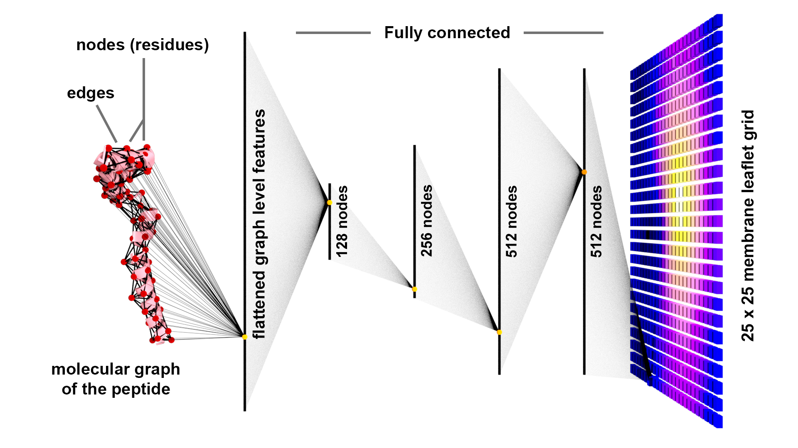
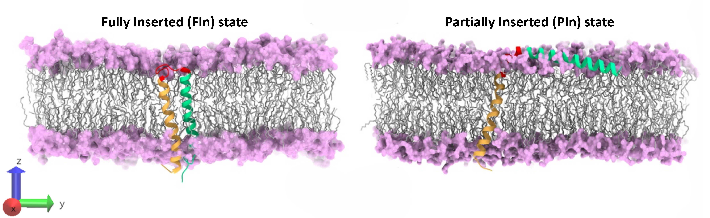
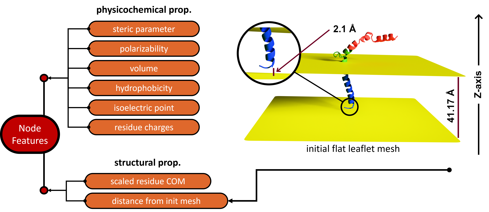
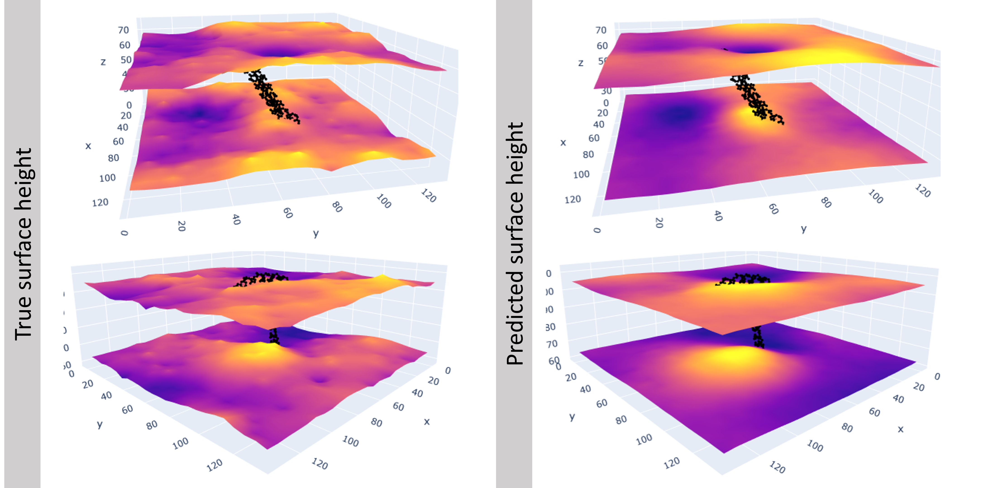

## Membrane to Protein: "All I Need is Your Attention !"

- **Authors:** Pallab Dutta
- **Affiliation:** Department of Biological Sciences, Indian Institute of Science Education and Research (IISER) Kolkata
- **Published in:** *The Journal of Chemical Physics*, March 2025
- **DOI:** [10.1063/5.0250082](https://doi.org/10.1063/5.0250082)

---

 
Imagine playing a guessing game. A friend has a small collection of objects — say, an apple, a coffee mug, and a little toy rhino. They take one, hide it under a flexible tablecloth, and your job is to guess what it is, relying only on the impression you see on the fabric. You might easily guess the apple or the mug. But what about the rhino?

This is where the game gets fascinating. If your friend places the toy rhino standing up on its feet, it creates one distinct pattern of bumps. But if they lay that same rhino on its side, it creates a completely different, longer, lumpier impression.

Your brain has to solve a complex puzzle: "Given this specific pattern of deformation, what object, in what orientation, is hiding underneath?"

The guessing game we just described — figuring out the object from the cloth's deformation — is a classic 'inverse problem'.

Fortunately, in our study we need to deal with the easier (really ?), forward problem — predicting how the tablecloth deforms for a given pose of the object. Here, our 'object' is a membrane-embedded protein, and the 'tablecloth' is a patch of the lipid leaflet of the cell membrane. We want to learn how this piece of leaflet deforms in the presence of this protein. But this protein is dynamic. To fold to its native state, it shifts, twists, and changes its structure — it adopts different 'poses', just like the toy rhino, causing the membrane leaflet to deform in diverse and complex ways. This is where the physics of our analogy and our system part ways. In the macroscopic world of our game, the cloth's deformation is caused primarily by gravity. However, at the molecular level, the rules are entirely different. The leaflet's shape is governed by a complex interplay of non-bonded interactions between the protein's atoms and the surrounding lipid molecules. Our model's job is to learn these complex fundamental, molecular-scale rules to predict the resulting geometrical patterns.

---

 

### Methodology

When I first began this research, I didn't have the rhino-and-cloth analogy. I started, as most research does, with a thorough literature survey on membrane-embedded protein folding. What I found was a significant gap: there were no promising models specifically designed to learn the dynamic adaptation of the leaflet to the protein's structural changes.

The problem itself felt untracked. This forced me to look for inspiration in completely different fields, which is what led me to the 'cloth' analogy. But this wasn't just a handy way to explain the problem; it became the key to solving it.

This new perspective led me to the world of computational cloth simulation. I was heavily influenced by a recent work ([ N-Cloth ](https://doi.org/10.1111/cgf.14493)) from Li <i>et. al.</i>, which demonstrated how a mesh-based model could learn to predict complex cloth deformations in the presence of other objects.

Inspired by this, I built a model using a Graph Attention Network (GAT). Our GAT model is specifically designed to learn the membrane curvature as a function of the protein's structure. 

<b>Figure 1</b> The Graph Attention model architecture for learning membrane surface geometry as a function of protein's structure and physicochemical properties. 

 
 

### Dataset
To generate our training data, we used fully atomistic molecular dynamics (MD) simulations from a [previous study](https://doi.org/10.1016/j.bbamem.2024.184333) in our group. The system we studied was the catalytic fragment of bacteriorhodopsin, which has two distinct states: one partially inserted (PIn) and one fully inserted (FIn) into the membrane (Figure 2).

<b>Figure 2</b> The membrane-embedded fully (FIn) and partially inserted (PIn) states of bacteriorhodopsin. 

#### Input | The Molecular Graph and Features 
For each embedded peptide conformation, we constructed a residue-level graph (Figure 1) with nodes = residues (center of mass coordinates + physicochemical features: steric parameter,
polarizability, volume, hydrophobicity, pI, net charge), and edges between residues within vander Waals cutoff. Following the 'N-Cloth' approach, we first set a flat membrane-mesh (Figure 3) primarily considering the mean distances between the two leaflets. Next the membrane leaflets are translated to match the average distance between the protein and lower-leaflet. In cloth simulation research, such initial flat meshes are considered as crucial template to learn a deformation as a function of a given object coordinate. For the learning purpose, the membrane leaflet surface (represented by P atom positions) was grided in the form of 25 x 25 bins. The spatial distance from each of these grid-centers of a flat membrane leaflet to the residues were used as an important feature during the training.

<b>Figure 3</b> Node features in the molecular graph are derived from the physicochemical and structural properties of each amino acid. The initial flat membrane mesh is positioned based on mean leaflet-leaflet and protein-leaflet distances.

#### Output | The membrane surface geometry
From the simulations, we constructed our dataset instances. The process for creating a single instance was as follows:

- We captured the resulting deformation of each leaflet (both upper and lower) as a 25x25 matrix representing the surface heights of its grids. However, this raw data collection process often resulted in empty grids, leaving gaps in our surface map. To ensure the data was continuous and to provide the model with a complete surface, we applied an Inverse Distance Weighting (IDW) fit over the raw data. This allowed us to fill these gaps. The final, interpolated height values from this process were then used as the ground truth ($Z_{true}$) for training our model.

- A single data instance was then created by pairing the molecular graph with its corresponding 25x25 leaflet matrix.

This method was applied to both the upper and lower leaflets, allowing us to build a complete dataset linking the protein's state to the specific geometry of its surrounding membrane.

---

 

### Key Findings
Using an 80/20 training/validation split, our model achieves strong predictive performance, with $R^2$ scores of 0.8833 (training) and 0.8784 (validation), respectively.A key finding is that while the true leaflet surface exhibits random thermal undulations in addition to the consistent curvature induced by the protein, our model learns to predict only the consistent patterns. It effectively filters out the random fluctuations, resulting in a smoother, averaged surface. 

<b>Figure 4</b> Top row corresponds to FIn states while the bottom row is for PIn states. First column refers to the true values of leaflet geometry ($Z_{true}$) and the second row refers to the predicted values for the same. 

 
 

Despite this averaging, the model accurately captures the specific, state-dependent deformations.

- For the FIn state, it correctly predicts a concave surface on the upper leaflet near the hinge region and a convex surface on the lower leaflet near the tails.
- For the PIn state, it shows that both the upper and lower leaflets form convex surfaces adjacent to the helix.

These state-specific findings are consistent with the curvature calculations from our previous studies.

---

 

### Take Home Summary

* We present a Graph based model for learning membrane surface deformation as a function of an embedded peptide's structure and physicochemical properties. 

* Due to its graph based architecture, training this model for a general membrane-embedded protein should be straightforward. 

* The model reaches $\sim 88\%$ accuracy in terms of $R^2$. 

* We benchmarked the predicted surface deformations with our previous curvature calculations. Moreover, we predict the leaflet deformation for an intermediate peptide structure not present in the training dataset (Read the [original paper](https://doi.org/10.1063/5.0250082)). 

### Future Directions

* Our current focus is to generalize the model's understanding of protein-induced membrane curvature. To achieve this, we are systematically expanding our training dataset to include a larger and more diverse set of membrane-embedded protein simulations.

* The successful development of this generalized model would represent a significant advance, ideally enabling ab-initio prediction of equilibrated membrane surface curvature from a protein's static structure alone.

* Looking further ahead, we aim to address the challenge of biological complexity by extending this framework to heterogeneous membranes.

---

 

### Availability of Paper and Codes

Please read our published paper for more details:
[JCP, 2020](https://doi.org/10.1063/5.0250082)

The codes are avilable for the scientific community at the GitHub repository: [https://github.com/mced-iiserk/Protein-CV-Membrane-Surface-Prediction](https://github.com/mced-iiserk/Protein-CV-Membrane-Surface-Prediction)

---

